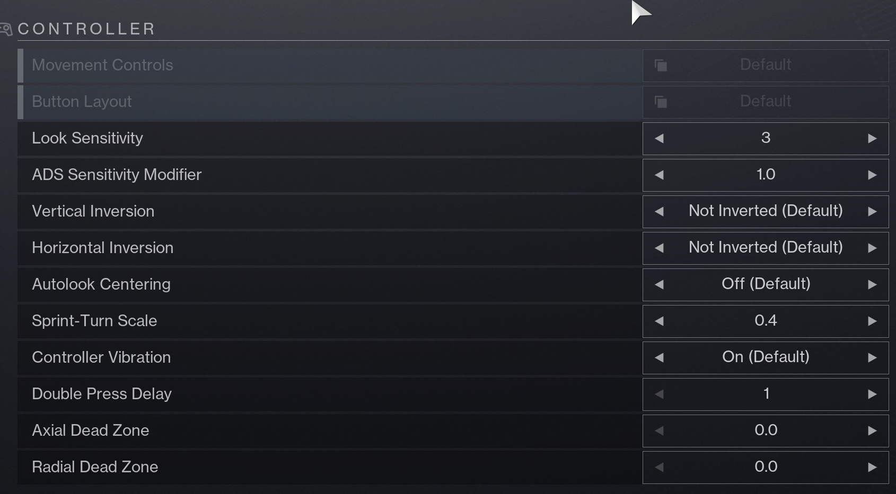
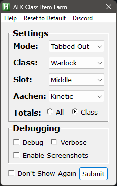

# Double Loot AFK Exotic Class Item Farm
### Download Link
Download the zip file from the [latest release](https://github.com/orchrist-pc/double-chest-tabbedout/releases/latest)

## About the Macro

This macro farms exotic class items fully automatically by opening chests in the Pale Heart.

Now introducing a tabbed out mode for [a2tc's 2 chest farm](https://github.com/A2TC-YT/afk-class-item-double-chest)!

Because of this increase in complexity in the original script as well as the added support for a tabbed out mode, the in game settings and setup matter much more than with similar macros, so **be sure to fully read through and follow the instructions below**.

If you are interested in learning more about how this macro works or about similar macros that work while you are tabbed out of the game join the [discord](https://thrallway.com).

## Support
If you like this macro and want to support my work, you can do so on [Ko-Fi - Orchrist](https://ko-fi.com/orchrist).

If you'd like to support the original creator whom this fork comes from, you can do so on [Ko-Fi - a2tc](https://ko-fi.com/a2tc_awesome_guy). 

Your support is greatly appreciated and helps us continue developing and improving macros like this. :3

## Required Settings
- AutoHotKey Version 1.1.37 is currently required.
Download [Here](https://autohotkey.com/download/1.1/AutoHotkey_1.1.37.02_setup.exe)
- Disable any Color Adjusting Overlays you may have
- Ensure HDR and Nightlight are OFF in Windows display settings (sometimes a restart is required after this change)

## Destiny Settings
### Sensitivity
- **Look Sensitivity**: Set to `6`
- **ADS Sensitivity Modifier**: Set to `1.0`
- **Aim Smoothing**: `Off`

  

### Bindings
- **Key Binding Storage**: Set to `Computer`
- **Toggle Sprint**: If you don't normally use toggle sprint assign this key to anything (example: set to `p`)
- **Bind Settings Key**: Assign to anything, just needs to be assigned
- **Ensure no keys are bound to CAPSLOCK**: This can and will break your script

### Controller Settings
- **Button Layout**: Reset to Default
- **Look Sensitivity**: `3`
- **Sprint-Turn Scale**: `0.4`
- **Axial Dead Zone**: `0`
- **Radial Dead Zone**: `0`
- **Vertical Inversion**: Not Inverted
- **Horizontal Inversion**: Not Inverted
- **Autolook Centering**: Off

### Display Settings
- **Window Mode**: Windowed
- **Resolution**: `1280 x 720`
- **Frame Rate Cap Enabled**: `On`
- **Frame Rate Cap**: `30 FPS`
- **Field of View**: `105`
- **Brightness**: Set to `7`
- **Screen Bounds**: Ensure screen bounds are set to `Max`
- You May need to Press W and D to max the screen bounds even if they look already maxed. Hit Enter to save.

  

### Visual Settings
- **HDR**: Disabled
- **Chromatic Aberration**: Disabled
- **Film Grain**: Disabled

  

- **HUD Opacity**: Set to `Full`
- **Colorblind Mode**: `Off`
- **Reticle Location**: `Center`

  

## Character Requirements
- **100 Mobility**: Yes, on every class (even warlock)
- **Jump**: Warlock - Burst Glide | Hunter - Triple Jump | Titan - Catapult Lift
- **No Movement Exotics**: No ST0MP-EE5, no TRANSVERSIVE STEPS, etc.
- **Weapon**: Get and equip the blue rarity sniper AACHEN-LR2 from collections, it can be either the kinetic or void one.
- **HEAVY Sword**: You must have a HEAVY sword equipped, does not matter what HEAVY sword.
- **Ghost Mod**: You must equip the `Wombo Detector` ghost mod (alternatively the `Expert Tracker` and `Treasure Hunter` ghost mods will actually work better but are no longer obtainable)

## How to Use

1. **Install AutoHotkey**
   - Make sure you have [AutoHotkey v1.1.37](https://www.autohotkey.com/download/ahk-install.exe) (not AHK v2) installed on your computer.
   
2. **Download the Latest Release**
   - Download the latest release of the macro from the [releases page](https://github.com/orchrist-pc/double-chest-tabbedout/releases/latest). Once downloaded, unzip the file to a folder of your choice.
   - Do Not Compile the scripts. They are intended to run in their raw .ahk state.

3. **Ensure Settings Match**
   - Before running the macro, ensure all your settings match the ones listed in the "Required Settings" section above. This includes sensitivity, bindings, display settings, and additional settings.

4. **Run the Macro**
   - Navigate to the unzipped folder and run `double_chest_farm.ahk` by double-clicking it. `DO NOT Compile the scripts into an exe.`
   - In the input box be sure to select what character you are using, what position they are on in the character select screen, and which aachen you have equipped.
   - If the UI for the stats is off the screen you can move the Destiny window and press F4 to reload the script.

5. **Keybinds**
   - Use the following keybinds to control the macro:
     - **Start Macro**: Press `F3`
     - **Stop Macro**: Press `F4`
     - **Close Macro**: Press `F5`
     - **Center the Window**: Press `F6`
     - **Open the Settings Menu**: Press `F9`
     - **Toggle the Overlay On/Off**: Press `F10`

## Settings Menu

- **Reset to Default**: This will delete your ini file and give you a fresh start

### Settings
   - **Mode**: This is the toggle to turn on Tabbed Out vs Mouse and Keyboard. (Mouse and Keyboard still works and is slightly faster than Tabbed Out)
   - **Class**: This dropdown lets you select the class you are playing on. This is important as it determines movement
   - **Slot**: Choose the slot this class shows up on your character select screen, this is important for reloading into orbit
   - **Aachen**: Choose which Aachen you have equipped
   - **Totals**: Toggle which stats are showing under "Total Stats". Just for this class, or for all classes.

### Debugging
**These settings can cause the script to run slower, only enable if you are having problems and need help.**
   - **Debug**: Toggle this to enable logfile generation for support purposes. Defaults to errors only.
   - **Verbose**: Enable verbose logging, this shows every success as well as errors.
   - **Enable Screenshots**: This will take screenshots at specific moments. Important for debugging problems

## Further Help
For more help or to ask other questions please join the [discord](https://thrallway.com).
